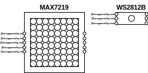

# LEDMatrix_Lib
Helper library for building LED matrices out of RGB LED Stripes or multiple LED matrix blocks.

# Matrix Styles (Chips)
You can either build your matrices with MAX7219 based 8x8 matrices or with custom build matrices out of WS2812B (NeoPixel) LEDs often found on RGB LED Stripes.
Either use MATRIX_MAX7219 or MATRIX_WS2812B as matrixChip parameters.

{:width="100%"}

# Matrix Connection Layout
You can either connect the rows of your matrix in ZIGZAG or ROW mode. Use either MATRIX_LAYOUT_ZIGZAG or MATRIX_LAYOUT_ROW as matrixLayout parameters.
Below are some examples on how to wire each layout.

## MAX7219
{:width="100%"}

## WS2812B
{:width="100%"}
