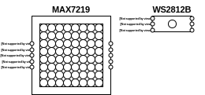

# LEDMatrix_Lib
Helper library for building LED matrices out of RGB LED Stripes or multiple LED matrix blocks.

# Table of Contents
1. [Matrix Styles (Chips)](#matrix-styles-chips)
2. [Matrix Connection Layouts](#matrix-connection-layouts)
	* [MAX7219](#max7219-layout)
	* [WS2812B](#ws2812b-layout)
3. [Function Documentation](#function-documentation)
	* [LEDMatrix::LEDMatrix()](#ledmatrixledmatrix)
	* [LEDMatrix::init()](#ledmatrixinit)


## Matrix Styles (Chips)
You can either build your matrices with MAX7219 based 8x8 matrices or with custom build matrices out of WS2812B (NeoPixel) LEDs often found on RGB LED Stripes.
Either use MATRIX_MAX7219 or MATRIX_WS2812B as matrixChip parameters.



## Matrix Connection Layouts
You can either connect the rows of your matrix in ZIGZAG or ROW mode. Use either MATRIX_LAYOUT_ZIGZAG or MATRIX_LAYOUT_ROW as matrixLayout parameters.
Below are some examples on how to wire each layout.

### MAX7219 Layout


### WS2812B Layout


## Function Documentation
### LEDMatrix::LEDMatrix()
>  **Command:** ```LEDMatrix::LEDMatrix(int size, int matrixChip, int matrixLayout, int[] pins)```  
>  **Params:**  
>		- int _size_: the size of the matrix, e.g. 16 for a 16x16 matrix  
>		- int _matrixChip_: one of the matrix chip constants (MATRIX_MAX7219 or MATRIX_WS2812B) depending on the chip used  
>		- int _matrixLayout_: one of the matrix layout constants (MATRIX_LAYOUT_ZIGZAG or MATRIX_LAYOUT_ROW) depending on the layout used  
>		- int[] _pins_: the pins used to control the matrix; array length depends on used matrixChip  
>  **Returns:**  
>    - _LEDMatrix Object_  
>
>  **Description:**  
>  Creates a new LEDMatrix object. You need to pass the matrix size, matrix chip, matrix layout and the pins on which the matrix is connected to the arduino.
>  For WS2812B _pins_ contains a single value: DIN.
>  For MAX7219 _pins_ contains 3 values: DIN, CS, CLK

### LEDMatrix::init()
>  **Command:** ```LEDMatrix::init()```  
>  **Params:**  
>		- _nothing_  
>  **Returns:**  
>    	- _nothing_  
>
>  **Description:**  
>  Initializes the pins and backend libraries. This method is required to be run in the setup() block.